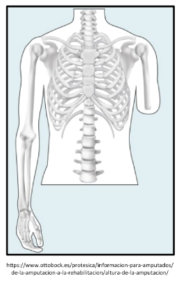
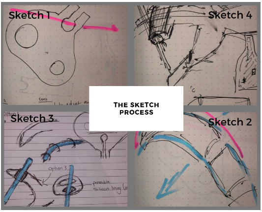
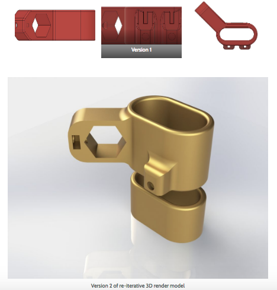
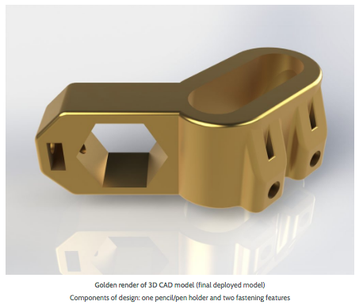
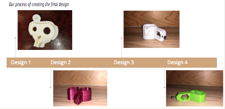
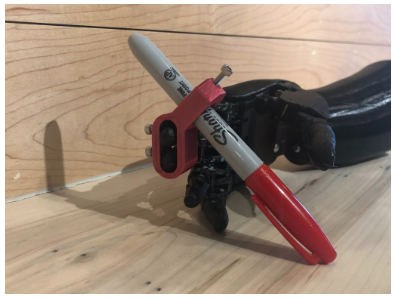

# **About**  

Founded on October 4th, 2019, the Grip design team is part of the Victoria Health and Regenerative Medicine Hackathon at Fort Tectoria, Victoria, BC.

We are a team of diverse multidisciplinary professionals who got together to design a 3D prosthetic grip for writing as part of the Victoria Hand Project. For this project, we went through the design process of ideation, building and testing iterative prototypes before we got to our product.

Our mission is to design and build a terminal 3D device that a unilateral upper-limb amputee can use in combination with the Victoria Hand.

# **Mission**  

Our mission was to propose, design, and build a 3D terminal device that an amputee can use in combination with the Victoria Hand.

# **The Problem**

Although the Victoria Hand Project models help unilateral upper-limb amputees with many tasks, they cannot always enable all of the tasks a user wants to complete in their day-to-day life. For example, unilateral amputee clients don't have the range of motions and autonomy to hold a pen or pencil to write or draw effectively. The also do not have a good grip and hold for pencils such that it feels natural.

# **Our Solution**

We made a universal, customizable, and modular 3D hand grip design such that it properly grips and holds, meets the rotational limitations of the hand and arms, and enables easy smooth writing with visibility of pen and paper. 

The pencil holder is a 3D printed device that can attach to two fingers, and will hold a pen/pencil of any size to assist in writing. For unilateral, lower-limb amputees (missing one hand) using utensils for writing can be extremely difficult, and clients many find it debilitating to ask a friend or family member for assistance.

It takes 45 minutes to print this device with poly lactic acid (PLA) filaments and costs less than 50 cents.

### We started with sketches of our models first:   

### We then built and tested our models:  

### Our design models and final deployment:    

Our final product is modular, customizable, scalable, and inexpensive to produce. The main features include adjustable pen size holder, adjustable finger wrap with fastener option for sturdy support and operation. The Fusion360 CAD model can be downloaded and viewed [here](https://myhub.autodesk360.com/ue2a91ff8/g/shares/SH56a43QTfd62c1cd968a5aebc11db6c1d48) and the code is available in the `PenholderV6.STEP` file.

Additionally, our project [website](http://www.thegrip.design) documents the re-iterative steps of design from ideation to building to testing prior to product release.

# **Research**   

Currently, a unilateral upper limb amputee experiences many task limitations with prosthetic hand designs. The current hand models do not have a good grip and hold option that feels natural for clients. They are also less autonomous to perform activities that require more fine movements.

For this project, we used one of the pre-existing writing devices made by Makers Making Change as our initial prototype inspiration for this project [1]. 

Victoria Hand Project has made many great prosthetic hand devices for use around the world and we used their child amputee prosthetic hand model to inform our 3D writing device model [2]. Our model is a response to the Victoria Hand Project's recent call for collaboration and proposal [3].

In a number of studies, many challenging or desired activities have been identified for prosthetic users. According to one investigation: "The most desired activity is using cutlery, followed by handicrafts, personal hygiene, opening and closing a door, dressing and undressing; the least wanted activity is writing with the prosthesis" [4]. This was our motivation for a design that is empowering clients' experience and enables a smooth and natural feeling for writing. 

More information on what prosthetic hand devices are, the types, and how they are used can be found on the Amputee Coalition page [5].

## **Team Members**  

Aesha Amer (Systems Information), Alistair Graham (Engineering), Baraa Daoud (Engineering), Jenessa Higgs (Engineering), Kate Forrest (Chief Maker), Noushin Noushin (Biology)

## **References**

1. [Victoria Hand Project](https://www.victoriahandproject.com/)
2. [Makers Making Change](https://www.makersmakingchange.com/) and [pen ball holder](https://www.makersmakingchange.com/project/pen-ball-holder/)
3. [Victoria Hand Project Proposal Page and project presentation](https://www.uvic.ca/research/centres/biomedical/assets/docs/challenge_3_victoria_health_hackathon.pdf)
4. [Literature Review on Needs of Upper Limb Prosthesis Users](https://www.ncbi.nlm.nih.gov/pmc/articles/PMC4864250/)
5. [Amputee coalition](https://www.amputee-coalition.org/how-prosthetic-hands-work/)

https://www.makersmakingchange.com/project/pen-ball-holder/